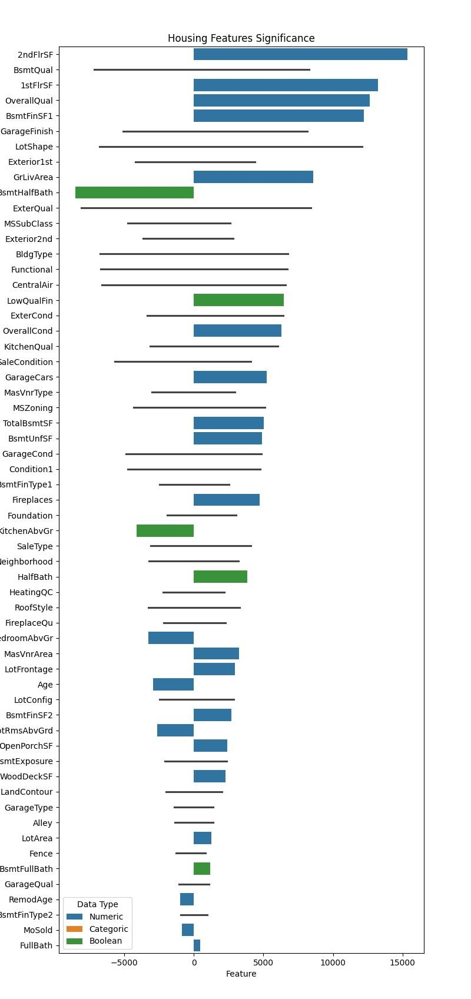

# What factors have a significant impact upon house prices?

## Overview

This report summarizes the work in the following Jupyter Notebook: <https://github.com/brians-hmt/Cap_Home/blob/main/capstone.ipynb>

### Business Opportunity:

There are tools like Zillow's Zestimate rating that attempt to give an evaluation or at least a price range to each property.  However, these tools usually lack specific information regarding the houses for which they are providing an estimate.  Using specific knowledge regarding a property under consideration, it should be possible to generate a better estimate.  Professional appraisers attempt to do this.  However, when an offer is made on a house, these appraisers generally try to find evidence to support the offer that the buyer has made.  They do this in order to provide the evidence that the loan originator needs to make the loan.  One can hire an appraiser to guess at the fair market value of 

It would be useful to have a tool / model that a buyer or investor could use to find good deals.

### Research Question:

What factors have a significant impact upon house prices?

As an added bonus, it would be nice to know how lot slope impacts house price.
It is expected that homes with significant lot slope would tend to have, in general, a better view. However, lot slope can mean that the owner has less usable land and that improvements are more costly.
I expect that there is an initial decrease in value as lot slope increases from flat but then begins to increase due to properties having a view.
It should be noted that housing data sets often do not contain an indication as to whether a property has a view. However, this could be hinted at by the PosA indicator (adjacent to a positive feature) in the Condition 1 or Condition 2 columns.

### Data:

There are many datasets with average housing data for specific communities. However, we need raw housing data containing individual sales. Ideally, this data would contain many columns of data that are not readily found in the many of the public data sets, e.g. Zillow housing data.
We will use the data in Deepak Sethi’s “house-prices-advanced-regression-techniques”. (https://www.kaggle.com/datasets/deepaksethi/housepricesadvancedregressiontechniques)

### Techniques:

The prediction of house price is essentially a regression problem. Thus, we will compare various regression techniques, such as Linear, Polynomial, Ridge, and Lasso regression.
Although the dataset has no labels indicating if properties have a view, we will look to see if the price data can be separated into two sets with different price computations.  

### Expected Results:

That the lot-size, house-size, # bedrooms, # bathrooms have the largest impact upon house price, and house condition (i.e. quality) have the biggest impact upon sales price.
That house condition is a bigger driver of price than is house age.
That view-properties can be determined by their asking price with some accuracy.
That having a view is a substantial driver of price.

## Data Cleaning

### Duplicate Data

We looked for duplicate data but found that no rows were duplicated.

### Handle Missing Data

We found that several columns were missing data as indicated in the following list:

| | Feature | NumNulls |
|---:|:---|---:|
| 0  | LotFrontage  | 259  |
| 1  | Alley        | 1369 |  
| 2  | MasVnrType   | 872  | 
| 3  | MasVnrArea   | 8    |
| 4  | BsmtQual     | 37   |
| 5  | BsmtCond     | 37   |
| 6  | BsmtExposure | 38   |
| 7  | BsmtFinType1 | 37   |
| 8  | BsmtFinType2 | 38   |
| 9  | Electrical   | 1    |
| 10 | FireplaceQu  | 690  | 
| 11 | GarageType   | 81   |
| 12 | GarageYrBlt  | 81   |
| 13 | GarageFinish | 81   |
| 14 | GarageQual   | 81   |
| 15 | GarageCond   | 81   |
| 16 | PoolQC       | 1453 |  
| 17 | Fence        | 1179 |  
| 18 | MiscFeature  | 1406 |  

Handling Approach:

1. Because Electrical was only missing a single values, we dropped this row.

2. All of the missing garage features corresponded to houses that had no garage.  This was determined by observing that these rows had GarageCars equal to 0.

3. All but 2 of the rows with missing basement features corresponded to houses that had no basement.  This was determined by observing that these rows had TotalBsmtSF equal to 0.  We dropped the 2 rows with basements that were missing basement data.

4. We determined that only 7 properties had pools.  Because this is such a small number, we decided to drop the pool columns, PoolArea and PoolQC.

5. We assumed that there should be some correlation between lot area and lot frontage, because lot frontage cannot be any more than 2 times the square root of the area.  Thus, we used a linear regression to fill the lot frontage using the lot area.

6. Alley, Masonary Siding Type, and Fireplace Quality are characteristic / nominal data.  Thus, we created a new 'NA' characteristic string value and filled the missing values with this 'NA' string.  This way, we did not need to drop any rows or columns.

7. Similar to the nominal data above, we filled the missing Fence data with 'NoFence' string.

8. Because there were only a small # of miscellaneous features, we dropped this column.

### Wrong Data Type

The MSSubClass data was an integer value.  However, it indicates the Ames Housing Classification.  This is nominal data, i.e. the # of stories and type of house, e.g. split-level or planned-unit-development.  Thus, we replaced this data with the appropriate string categories.

## EDA

### Univariate Analysis

#### Nominal Features:

Distribution plots were made for all categorical (generally nominal) and numeric features.  The plots of nominal data showed significant unbalance in the data.  Most of these plots when sorted by decreasing occurrence looked like either an logarithmic or linear decline, such as the following.  

Some of these features appeared to be predominantly one value, e.g. Street, Utilities, Condition2, RoofMatl, Heating, and HouseStyle.  Because these were virtually all one value, they would have little value to the modeling.  These columns were dropped.

Because of the imbalance in the data, we would normally want to drop categorical values that had a 'small' number of values.  However, doing that for this data set would result in no rows of data.  However, if there were too few values for any value type in a category, the test dataset might contain a value that was not in the training set.  Thus, we decided to merge any category with fewer than 100 values into an Other category.  This made it possible to keep features without dropping rows.

#### Numeric Features:

We converted all year data (YearBuilt, YrSold, YearRemodAdd, and GarageYrBlt) into age data.  We used 2010 as the reference for this conversion as it was the latest date in the dataset.

We examined the distribution of sales prices (see below) and decided to drop the top and bottom 2% in order to get rid of outliers.

Name:   SalePrice
-----------------
count      1102.0
mean     174059.0
std       60290.0
min       84500.0
2%        89510.0
5%        98645.0
10%      109540.0
20%      124580.0
50%      159000.0
80%      224400.0
90%      264062.0
95%      303378.0
98%      325618.0
max      360000.0

The distributions for the numeric features were used to set the cutoff points for eliminating outliers.  These points were chosen to eliminate data that was not contiguous with the bulk of the distribution.  The following cutoffs were set:

	LotFrontage < 125
	LotArea < 20000
	MasVnrArea < 700
	TotalBsmtSF < 2500
	1stFlrSF < 2500
	GrLivArea < 3000
	GarageArea < 1000
	WoodDeckSF < 500
	OpenPorchSF < 300
	EnclosedPorch < 300
	RemodAge < 58
	GarageAge < 250

Rather than dropping the rows with these values, they were set to NA so that they later could be set to 0 (or some other value) for modeling.  

### Bivariate Analysis

There were too many numeric features to make pair-plots of all these features at once.  Therefore, pair-plots were created for similar features, e.g. all of the garage features.  All pair-plots included Sale Price so that the correlation could be visually evaluated between Sales Price and these other numeric features.  

The basement pair-plot seemed to indicate that the total basement square footage has the best correlation to sales price of any of the basement features.  This should be the sum of the other 3 basement square footages.  Thus, it might be best to just use the TotalBsmtSF and drop the other basement SF features.

The garage pair-plot showed that price has a positive correlation to garage area and a negative correlation to Garage Age.  Thus, these seem to be important features to use in our model.  We have already seen a strong correlation to GarageCars and GarageArea.  So, it could be that we only need one of these features for a simplified model.

The floor area pair-plot showed that the ground floor living area is correlated strongly to the 1st and 2nd floor square footages.  Thus, we may not need all 3 of these features.  We may just need the ground floor living area.

The age and quality pair-plot showed that the price correlates most strongly to the overall quality but that there is some inverse relationship to Age and RemodAge.  It could be that the quality is the only really important factor here.

Using this aforementioned information, the best-of pair-plot was created.  This plot shows the features that appear to have the most correlation with Sales Price.  This plot is shown below:

Numeric correlations were computed between each numeric feature and Sale Price.  This showed that SaleAge is the only column that doesn't have an impact upon sales price (other than potentially adjusting for inflation).

Of the values that we previously observed a high correlation, we should:
1. Keep GarageCars instead of GarageArea as it appears to be more highly correlated to price.
2. Drop GarageAge in lieu of Age due to their correlation with price.

A heatmap was generated showing the correlation of all of the numeric values, which is shown below.  This shows a high correlation rate among the employment variability rate, the euribor3m, and the number of unemployed.  For the first run of modeling, he euribor3m was kept and the other 2 features were dropped.  Later, the PCA was used to combine these 3 variables, thereby reducing the dimensionality of the data. However, re-running the models did not show significant changes in model test accuracy.

### Most Significant Numeric Features

{height=66%}

Most of the correlations listed in the heat map make intuitive sense.    
The house quality, above-ground square footage, garage size, basement size, 1st floor size, and house newness have the most impact upon sales price.   
There are, however, a few surprises:  Enclosed Porch, Kitchen Above Ground, Overall Condition, and Low Quality Finish Square Footage have a negative impact upon the price.    

This data indicates that an enclosed porch has a negative impact upon value and yet the porch square footage has a positive correlation.  Thus if a property has an enclosed porch, there might be some value to tearing down the walls.  This is especially true if the porch walls are not in good shape.    

Total rooms above ground has a strong correlation to price.  Since having a kitchen above ground has a negative correlation to price, there might be a benefit to remodel to move an upstairs kitchen to the ground floor.  However, it is worthwhile to note that there is more value to be had if the property is in poor condition.  Otherwise, one might not get a return on the investment.   

The negative correlation of month sold to price is probably an artifact of this feature being handled as a numeric value, e.g. month of year.  We should convert this to a categorical value, because we do not expect a simple correlation between these two values.  The spring and summer months should have the highest demand and thus the highest prices.  Therefore, we should convert this to a categorical feature using the month names.    

Because the low quality finish square footage has a negative impact upon price, it may make sense to replace some low quality fixtures with something cheap but mid quality from Contractor's Wherehouse or Home Depot.  Some cheap but quick fixes like painting also might make sense.   

We will convert the sales month feature in a future revision of this work.

## Data Preparation

The data preparation for this first version entailed replacing the numeric feature NAs with 0 values.
An 80/20 train/test split was made for the purpose of training and evaluating all models.

## Modeling

### Baseline Model

A simple linear regression model was used for our baseline model.  This model was trained on different datasets and these were compared.

This model was first trained and tested on only the numeric features.  The model was then trained and tested on all features.  Then, the following features were removed, because they have low correlation values with Sale Price:  'MiscVal', '3SsnPorch', 'LandSlope', 'PavedDrive', 'ScreenPorch', 'Electrical', 'EnclosedPorch', and 'BsmtCond'.  This reduced dataset was then used to train and test the model for a third time.

| Dataset | Train RMSE | Test RMSE |
|:---|---:|---:|
| Numeric Only	| $23,525		| $28,017 |
| All Features	| $18,794		| $26,411 |
| Reduced Feat.	| $18,813    	| $26,403 |

## Results

We examined the coefficients from the trained models.  The results appear to confirm our earlier suggestion that kitchens above ground have a negative impact upon the sales price.      

However, this model also seems to indicate that bedrooms above ground have a negative impact.  However, this may need to be combined with positive correlation with the square footage above ground or with the total number of rooms.  In other words, having more bedrooms or rooms in the house is an asset.  However, if those rooms are on a higher floor, they may have less value than if they are on the ground (i.e. 1st) floor.

With our model, we see a negative value for averge (ALQ) basement finish type and a positive value for a good finish (GLQ).  Ergo, it may be worthwhile to consider a quick beautification of the basement before sale.    

Because there is such a high negative correlation ~$8.4k with having a basement half bath and only an ~$3.4k value to having this as an extra half bath, one might consider removing this half bath ... as long as tearing it out doesn't cost more than $5k.  In other words, this might only make sense for an owner to do and not an investor.   

The Test RMSE above indicates that our price estimate is off by $26.4k on average, which is a fairly significant proportion of the $180k mean housing price of the dataset.  Thus, futher models should be explored including an ensemble model.  The hope is that this accuracy could be improved.

### Evaluation

Although our dataset has many features that we can evaluate for their impact upon price, we are limited in the total number of rows of data.  More specifically, much of the categorical data is limited in the number of each value that is present in the data.  We delt with this by combining rare data in to a category 'Other'.  This approach is only helpful if the remaining categorical values are significantly different from those that are grouped together.  In the simplest case (with two categorical values), this is a way of stating that a category is either one thing or not that thing.  In other words, this simply reduces the number of columns when one-hot encoding.   

We should recommend to the client that we need to get more data to refine our model.  At a minimum,  we should get better representation of those feature values that are of interest.    

## Report to Client

My research indicates:

There are many home features that impact price that we cannot change, such as the square footage of the house or the shape of the lot.  However, there are several that we can change.  The most significant of these are the quality factors.  In particular the basement quality, overall quality, and garage finish have significant impact upon the sale price of a home.  These are features that can be changed before a home is put on the market.  This information can be considered when making a purchase of a property.

In addition, there are a few unexpected items that have a negative impact upon the sale price that could be changed (if they are not in good repair).  Among these are having a half-bath in the basement and having a kitchen on an upper floor.  When looking for a property to purchase, these might be features to consider, especially if in disrepair.

## Next Steps

We intend to continue this effort by creating and comparing additional models in the hope that we can reduce the test error.  We will try other model, such as a Ridge Regression, Lasso Regression, and an Ensemble technique.

